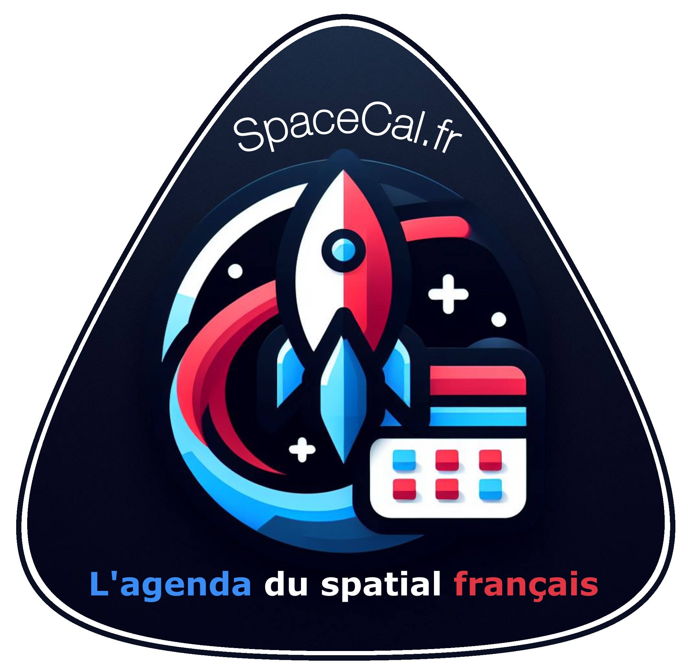

# SpaceCal-Fr - Agenda des événements du spatial du 9 au 15 février 2026

Bonsoir à toutes et tous,

C'est dimanche et voici votre rendez-vous hebdomadaire des nombreux et passionnants événements du spatial français de cette nouvelle semaine de février !

⤵️🧶❤️🛰️

## Lundi 9 février
2 événements :

1. ***Rencontre avec le secteur spatial irlandais*** : rencontre avec des entreprises et des acteurs de la recherche du secteur spatial irlandais, afin d’explorer des opportunités concrètes de partenariats, d’innovation et d’accès aux programmes européens.
Événement sur inscription réservé aux membres Aerospace Valley. Début à 8h30 au B612, Toulouse (31).

2. ***Journées Météo de l’Espace 2026 - Space Weather Days 2026*** : événement dont l'objectif est de rassembler la communauté française de la météo de l’espace afin de discuter des récents progrès de la recherche dans ce domaine. 
Jusqu'au 10 février à l'Université Grenoble Alpes - Bât. IMAG, Saint-Martin-d’Hères (38).

## Mardi 10 février
6 événements :

1. ***MILO Seminar - Conquering Earth Observation Heterogeneity : From Atomic Scalars to Resolution-Adjustable Foundation Models"*** : événement COMET TSI (Traitement du Signal et des Images) du CNES afin de présenter des solutions innovantes pour surmonter l’hétérogénéité croissante des données d’Observation de la Terre (EO), causée par la multiplication des satellites produisant des données variées (résolutions spatiales, spectres, temporalités). 
En visioconférence et en anglais. À 13h30 à En ligne, Toulouse (31).

2. ***De l’astronomie à la métrologie, ou la construction de l’internationale scientifique avec la création du Bureau international des poids et mesure*** : par Céline Fellag Ariouet, Bureau international des poids et mesures (BIPM), dans le cadre du séminaire d'histoire des sciences astronomiques de l'Observatoire de Paris.
Début à 14h à Salle du Conseil - Observatoire de Paris, Paris (XIVe).

3. ***Un siècle d'astrophysique*** : par Jean-Philippe Uzan, directeur de recherche en physique théorique au CNRS. Dès 15h au Beffroi de Montrouge (92).

4. ***Soirées Galactiques Hivernales*** : moment exceptionnel au sommet des Pyrénées comprenant un accès au Pic du Midi, une séance de planétarium, une visite libre de l'observatoire, puis des animations astronomiques avec des astronomes et scientifiques passionnés qui vous accompagnent pour l’observation du ciel du moment, à l’œil nu et à l’aide de télescopes depuis la Mongie.
Plusieurs dates en décembre et février/mars.
Début à 16h30 au Pic du Midi & à la Station de La Mongie, La Mongie (65).

5. ***Observer les étoiles filantes à l’œil nu : un spectacle accessible à tous*** : par Jérémie Vaubaillon, astronome, IMCCE, Observatoire de Paris.
À 18h30 à l'amphithéâtre Claude Bernard, Faculté des Sciences Mirande, Dijon (21).

6. ***À la recherche des accélérateurs cosmiques surpuissants*** : par Simon Chiche, astrophysicien à l’Institut d’astrophysique de Paris, dans le cadre des conférences du Forum des Sciences.
Début à 18h30 au Forum des sciences de Villeneuve-d'Ascq (59).

## Mercredi 11 février
3 événements :

1. ***Décollage de Sophie Adenot : portes ouvertes à la Cité de l’espace*** : à l'occasion du lancement de la mission Epsilon, la Cité de l'Espace ouvre gratuitement ses portes au public pour suivre en direct le décollage de la française Sophie Adenot vers la Station Spatiale Internationale.
Lancement en direct entre 11h et 12h45.
En cas de report du décollage, la Cité de l’espace reprogrammera l’événement gratuit à la nouvelle date communiquée.
À partir de 10h à la Cité de l'Espace, Toulouse (31).

2. ***L'Astronomie en Antarctique*** : par Djamel Mekarnia, astrophysicien à l'OCA, dans le cadre des conférences mensuelles de la Société d'Astronomie de Cannes.
Début à 17h30 à la Maison des associations, Cannes (06).

3. ***Extraordinaires planètes extrasolaires*** : par Guillaume Hebrard, astrophysicien IAP et OHP, dans le cadre des conférences mensuelles de la Société Astronomique de France (SAF).
Retransmis en direct sur la chaîne YouTube de la SAF. À 19h au Conservatoire national des arts et métiers (CNAM), Paris (IIIe).

## Jeudi 12 février
10 événements :

1. ***Exploration des exoplanètes extrêmes et de l’activité stellaire à l’aide de missions de petits satellites*** : par Kevin France, professeur au LASP/Université du Colorado, dans le cadre de la série de séminaires dédiés aux projets de nanosatellites scientifiques de la Fédération Nanosats.
En ligne sur inscription.

2. ***Complex Days*** : 6e édition de cet événement destiné à favoriser le dialogue entre les disciplines en rassemblant des scientifiques issus d'horizons divers (mathématiques, physique, chimie, sciences de la Terre et de l'Espace, sciences humaines et sociales, etc.) qui travaillent sur les systèmes complexes.
Organisé par l'Académie "Systèmes Complexes".
Jusqu'au 13 février à l'Hôtel Sheraton - Grand Arénas, Nice (06).

3. ***IPSAIR 2026*** : 7ᵉ Festival du Vol de l’IPSA qui propose une immersion totale au cœur de l’aéronautique et du spatial. 
Au programme : simulateurs de vol, découverte de moteurs et de pièces d’exception, conférences inspirantes menées par des experts du secteur.
Dès 10h au Campus de l'IPSA, Toulouse (31).

4. ***Conf’ voisines - Qu’est-ce que les astéroïdes ont à nous dire ?*** : par Barbara Gollain, responsable du Musée de minéralogie, Jardin des sciences de l’Université de Strasbourg/EOST et Jean-Yves Marchal, médiateur scientifique au Jardin des sciences de l’Université de Strasbourg.
Début à 14h30 à Médiathèque d'Haguenau (67).

5. ***A La Découverte Des Trous Noirs*** : par le Dr. Vivien Scottez, astrophysicien et Directeur de l’Observatoire, dans le cadre des conférences de l'Université Catholique de Lille.
À 18h à l'Université Catholique de Lille (59).

6. ***Épique époque - À qui appartient l’Espace ?*** : par Claire Elss,  avocate, juriste, présidente de Cosmos for Humanity, et Aurélie Trur, chercheuse en politiques spatiales, International Space University.
Rencontre animée par Elea Heberlé et mise en images par l’illustratrice Amina Bouajila.
À 18h30 au Planétarium du Jardin des sciences, Strasbourg (67).

7. ***La météo de l'Espace*** : par Lionel Birée, ingénieur de recherche en aérospatiale et fondateur d'ELIOS-SPACE, pour l'association planétarium J.Valéri.
Début à 18h30 au Collège J. Valéri, Nice (06).

8. ***Astronomie et climat*** : par Gilles Bogaert, physicien à l’Observatoire Côte d’Azur, dans le cadre des conférences organisées par l'association Science pour tous 06.
À 19h à la Médiathèque de L’Escarène (06).

9. ***Satellites de Saturne et Jupiter : dernières découvertes*** : par Valéry Layné, astronome à l'Observatoire de Paris, dans le cadre du Café des sciences de Louv'Science.
Début à 20h30 à la MJC de Louveciennes (78).

10. ***Y-a-t-il de la vie sur Mars ?*** : par Nicolas Mangold, directeur de recherche CNRS, et Evan Blanc, doctorant, du laboratoire de Planétologie et Géosciences à Nantes, dans le cadre des conférences de la Société d'Astronomie Populaire de Limoges.
Dès 20h30 à la Faculté des Sciences et Techniques - Amphithéâtre Billy, Limoges (87).

## Vendredi 13 février
2 événements :

1. ***[Séminaire IPGP] Utilisation des images satellite pour suivre les radeaux de Sargasses et prévoir leurs échouements dans les Caraïbes*** : par Audrey  MINGHELLI, LIS / Université de Toulon, organisé par les Masters 2 FRS, GAED / TGAE et IG-AST de l’Université Paris-Cité, de Sorbonne Université et de l’ENSG, dans le cadre de leur série annuelle dédiée à l’observation spatiale, la géomatique et leurs applications.
À 14h à l'IPGP, salle P07 Outremer, Paris (Ve).

2. ***Espace : les 50 prochaines années*** : par Nicolas Prantzos, astrophycicien à l'Institut d'Astrophysique de Paris (IAP) et écrivain, dans le cadre des conférences de l'association Andromède.
Dès 20h30 à l'Observatoire historique de Marseille, Marseille (13).

## Samedi 14 février
1 événement :

1. ***Pluton*** : par Olivier de Goursac dans la cadre des Réunion de la Commission de Planétologie de la SAF.
Retransmis en différé sur la chaîne YouTube de la SAF. Début à 15h au Siège de la SAF, Paris (XVIe).

## Dimanche 15 février
1 événement :

1. ***Comprendre les lois de la nature*** : par Christophe Galfard, physicien, dans le cadre d'un cycle de conférences à la portée de tous pour vous faire voyager à travers la réalité qui vous entoure, depuis les atomes qui composent nos corps jusqu’aux trous noirs, en passant par le Big Bang, le futur de l’univers et tout ce que nos sens ne perçoivent pas.
Conférences accompagnées d'une projection de petits films et d’images de l’univers.
À 11h au Cinéma mk2 Odéon (côté St Germain), Paris (VIe).

---

Voilà, l'actualité prévisionnelle c'est terminé pour ce soir 😉

Retrouvez **l'intégralité des liens vers les sites officiels** des événements cités ainsi que tous les autres événements à venir sur nos flux, nos Apps et notre site Internet [https://www.spacecal.fr](https://www.spacecal.fr/)

Merci de nous avoir lu, **n'hésitez pas à republier cette lettre pour en faire profiter le plus grand nombre**, à bientôt et très bonne semaine à vous... 🖖
