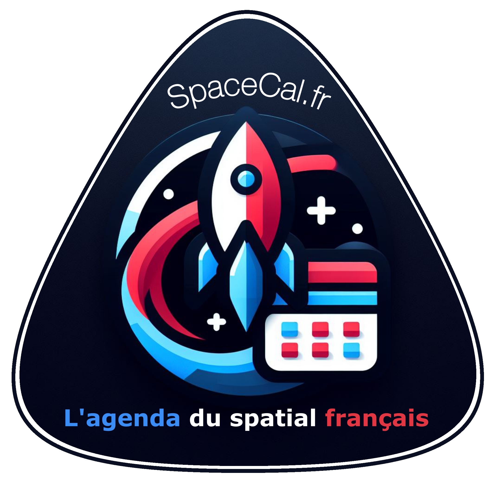

# SpaceCal-Fr - Agenda des événements du spatial du 9 au 15 mars 2026

Bonsoir à toutes et tous,

C'est dimanche et voici votre rendez-vous hebdomadaire des nombreux et passionnants événements du spatial français de cette nouvelle semaine de mars !

⤵️🧶❤️🛰️

## Lundi 9 mars
5 événements [(tous les liens sur SpaceCal-Fr)](https://www.spacecal.fr) :

1. ***La révolution satellitaire des télécoms*** : avec Guillaume Kempf, porte-parole français de Skylo Technologies et Jessy ASMAR, head of Satellite Factory, Orange Wholesale, dans le cadre de SMART TECH, le magazine quotidien de l’innovation de B SMART 4Change, animé Delphine Sabattier. Début à 10h45 sur la chaîne TV B SMART 4Change.

2. ***Rencontre avec le secteur spatial taïwanais*** : la coopération R&D France–Taïwan offre des opportunités concrètes de projets communs dans le spatial, centrée surtout sur les équipements au sol pour satellites LEO (antennes, RF, PCB, terminaux, matériaux).
Une occasion privilégiée de créer des synergies industrielles et technologiques.
Événement sur inscription réservé aux membres Aerospace Valley & Gifas. À 13h au B612, Toulouse (31).

3. ***ESA Future Space Transportation Spring Session*** : 4e édition de la session de printemps du futur transport spatial de l'ESA qui rassemble l'ESA, l'industrie, les investisseurs et les délégués des États membres pour examiner les progrès des activités de transport spatial en Europe. 
À 14h au quartier général de l'ESA, Paris (XVe).

4. ***Les femmes à la conquête de l’espace*** : table ronde consacrée aux parcours féminins dans le secteur spatial organisée par la Fondation de l’École normale supérieure dans le cadre du Mois « Femmes et filles de sciences ».
Avec Fatima Iervolino, ingénieure spatiale chez ArianeGroup, Pamela Meuleye, créatrice de Space Women Alliance, Global director Customer excellence chez Eutelsat et Jade Ricouart, responsable préparation du futur chez MBDA.
Début à 18h30 à l'École Normale Supérieure, Paris (Ve).

5. ***Parcours scientifique et engagement dans l’ingénierie*** : par Aya AIDOUNI dans le cadre du cycle de conférences « 1 jour 1 étoile », organisé par Space & Technology Sorbonne.
Dès 18h30 au Campus Pierre et Marie Curie - Bât. Esclangon - Amphi. Durand, Paris (Ve).

## Mardi 10 mars
8 événements [(tous les liens sur SpaceCal-Fr)](https://www.spacecal.fr) :

1. ***Paris Space Week*** : 13e édition du salon professionnel consacré à l'industrie spatiale.
Accès payant, exclusivement réservé aux professionnels. Jusqu'au 11 mars à l'Espace Champerret, Paris (XVIIe).

2. ***Journée de la recherche Geodata/IGN 2026*** : 35e édition de cet événement organisé par l'Université Gustave Eiffel, l'IGN et Géodata Paris (ex ENSG-Géomatique), qui proposera un panorama des recherches que mènent les trois laboratoires de l'IGN / Géodata Paris : le laboratoire en sciences et technologies de l'information géographique pour la ville intelligente et les territoires durales (LASTIG), le laboratoire d'inventaire forestier (LIF) et l'équipe IPGP / Géodésie.
Début à 9h à l'Université Gustave Eiffel - bâtiment Bienvenüe, Champs-sur-Marne (77).

3. ***Séance Hommage à Yvonne Choquet-Bruhat*** : L’Académie des sciences rend hommage à l’héritage scientifique d’Yvonne Choquet-Bruhat (1923-2025) en organisant une journée qui passera en revue son domaine de recherche principal: la théorie de la relativité générale.
Début à 9h30 à la Coupole de l'Institut de France et Grande Salle des séances, Paris (VIe).

4. ***Nanolab Academy - L'aventure spatiale commence ici !*** : par Nicolas Verdier, chef du projet Nanolab Academy au CNES, pour Terre des Sciences.
À 18h à l'ESEO, Angers (49).

5. ***Énergie, science et fiction*** : par Roland Lehoucq, astrophysicien CEA et président de la SAF, dans le cadre des conférences canapé organisées par la Maison pour la science en Centre - Val de Loire.
Dès 18h à l'amphithéatre Cabannes, Polytech Orléans site Vinci , Orléans (45).

6. ***L’autonomie européenne : plus de souveraineté ou plus de coopération ?*** : table ronde IPSA où les invités dresseront un panorama complet des enjeux de souveraineté ou de coopération européenne dans le secteur aéronautique et spatial. 
Les intervenants (Thales Alenia Space, Gicat, ICMA, DGC et CDE) partageront leur vision de l'autonomie européenne et du rôle des ingénieurs pour y répondre.
À 18h à l'IPSA Campus Paris-Ivry & et sur Teams, Ivry-sur-Seine (94).

7. ***Dans les coulisses d’un métier pas comme les autres, instructrice d’astronautes !*** : par Laura André-Boyet, instructrice d’astronautes au Centre Européen des astronautes de l’Agence Spatiale Européenne (ESAV). Dans le cadre du cycle "Les femmes scientifiques sortent de l’ombre".
Début à 18h30 au Quai des savoirs, Toulouse (31).

8. ***L’électronique au service du quotidien et de l’innovation*** : par JessiLab dans le cadre du cycle de conférences « 1 jour 1 étoile », organisé par Space & Technology Sorbonne.
À 18h30 au Campus Pierre et Marie Curie - Bât. Esclangon - Amphi. Durand, Paris (Ve).

## Mercredi 11 mars
6 événements [(tous les liens sur SpaceCal-Fr)](https://www.spacecal.fr) :

1. ***Les prolongements de la Relativité Générale*** : par Eric Gourgoulhon, directeur de recherche au CNRS (Laboratoire Univers et Théories, Observatoire Paris-Meudon), dans le cadre des conférences mensuelles de l’association Aquila.
Début à 18h au Campus de Valrose - amphi informatique, Nice (06).

2. ***Les 1001 métiers de l'aéronautique et du spatial*** : par Gérard Laruelle, membre Émérite de la 3AF, membre de l'Académie de l'Air et de l'Espace (AAE), pour le Comité Jeunes 3AF et le groupe 3AF Ile-de-France.
Un webinaire pour en savoir plus sur l'ensemble des techniques associées aux industries de l'aéronautique et du spatial, découvrir la diversité des métiers, bénéficier de quelques recommandations et exprimer ses questions.
Début à 18h en ligne (Zoom).

3. ***À la recherche des neutrinos : comment voir l’invisible*** : par Anselmo Meregaglia, professeur et physicien au LP2i de Bordeaux, dans le cadre des conférences mensuelles de la société astronomique de Bordeaux.
À 18h30 à l'Hôtel des sociétés savantes, Bordeaux (33).

4. ***Trajectoires croisées, leadership féminin et place des femmes dans les environnements techniques*** : par Fatima Iervolino dans le cadre du cycle de conférences « 1 jour 1 étoile », organisé par Space & Technology Sorbonne.
Dès 18h30 au Campus Pierre et Marie Curie - Bât. Esclangon - Amphi. Durand, Paris (Ve).

5. ***Après l’ELT, quel avenir pour la communauté astronomique européenne ESO ?*** : par Roland Bacon, astrophysicien CRAL – Observatoire de Lyon, dans le cadre des conférences mensuelles de la Société Astronomique de France (SAF).
Début à 19h au Conservatoire national des arts et métiers (CNAM), Paris (IIIe), et retransmis en direct sur la chaîne YouTube de la SAF.

6. ***La Lune et l'autre*** : par Bruno Mongellaz, technicien à l'Observatoire de Calern et secrétaire Général de SPICA, dans le cadre des conférences mensuelles de la Société d'Astronomie de Cannes.
À 19h30 à la Maison des associations, Cannes (06).

## Jeudi 12 mars
6 événements [(tous les liens sur SpaceCal-Fr)](https://www.spacecal.fr) :

1. ***Aalto suite*** : par Jaan Praks, professeur associé à l'Université d’Aalto, dans le cadre de la série de séminaires dédiés aux projets de nanosatellites scientifiques de la Fédération Nanosats.
Horaire et titre définitif à venir. En ligne.

2. ***Mesures Millimétriques de Dispositifs Hyperfréquences*** : premier Comité d’Experts Techniques (COMET) sur le thème de la mesure millimétrique de dispositifs hyperfréquences, cet événement se veut être un moment de rencontre et d’échanges nourris entre différents intervenants et industriels concernés et impliqués dans la mesure de composants et systèmes hyperfréquences.
En présentiel uniquement. Dès 08h30 au CNES - Centre Spatial de Toulouse (31).

3. ***Webinaire de formation Dinamis*** : thème "Recherche, sélection, téléchargements d’imageries et découverte du programme PWH (Pléiades World Heritage)"
Une session essentielle pour maîtriser les nouveaux outils DINAMIS et découvrir les richesses du programme PWH.
Un replay sera disponible sur la chaîne YouTube de DINAMIS. Dès 09h en ligne (Zoom).

4. ***Météorologie de l'espace : du scientifique à l'opérationnel*** : par Lionel Birée, ingénieur de recherche en aérospatiale et fondateur d'ELIOS-SPACE, pour Terre des Sciences.
Début à 10h30 à l'Université Angevine du Temps Libre, Angers (49).

5. ***Le problème des origines de la vie aux origines de la biologie : Lamarck, Schwann, Darwin*** : par Laurent Loison, directeur de recherche au laboratoire SPHERE (UMR 7219, Université Paris-Cité), dans le cadre des conférences de la société française d'exobiologie (SFE).
À 11h30 en ligne.

6. ***Quels matériaux pour l’aéronautique et le spatial de demain ?*** : par Christophe Laurent, professeur de chimie des matériaux à l’Université de Toulouse, dans le cadre du nouveau cycle des conférences scientifiques « Les Ouvertures » 2025/26, consacré au thème : Ciel, espace, univers : quels enjeux pour notre planète et pour la science ?
Début à 12h30 à l'Auditorium Marthe Condat - Université de Toulouse (31).

## Vendredi 13 mars
6 événements [(tous les liens sur SpaceCal-Fr)](https://www.spacecal.fr) :

1. ***Simuler les aurores polaires et les phénomènes cosmiques*** : Jean Lilensten, astrophysicien à l’IPAG-OSUG et Julien Milli, astronome à l’OSUG vous convient à une démonstration de la planeterrella, le simulateur auroral, qui permet d’admirer les relations entre le Soleil et les planètes et de comprendre comment se forment les aurores polaires (à partir de 10 ans).
Début à 12h30 à l'OSUG, Domaine Universitaire, bât. OSUG-D, Saint-Martin-d’Hères (38).

2. ***Construire sa carrière dans les sciences et oser les parcours ambitieux*** : par Erika Velio dans le cadre du cycle de conférences « 1 jour 1 étoile », organisé par Space & Technology Sorbonne.
À 18h30 au Campus Pierre et Marie Curie - Bât. Esclangon - Amphi. Durand, Paris (Ve).

3. ***Les ondes gravitationnelles de LISA et de PTA (Pulsar Timing Array)*** : par Antoine Petiteau, membre de la LISA Science Team de l'ESA, pour le Club d'astronomie d'Anthony.
Sur inscription par mail à contactcaa18@astroantony.com.
Dès 20h30 à l'Espace Henri Lasson, Antony (92).

4. ***50 ans de découvertes astronomiques*** : par Françoise Combes, astrophysicienne à l'observatoire de Paris, dans le cadre des conférences de l'association Andromède.
Dès 20h30 à l'Observatoire historique de Marseille (13).

6. ***Observer l'invisible : les lentilles gravitationnelles pour sonder la structure de l'Univers*** : par Anna Niemiec, enseignante-chercheuse au Laboratoire de Physique Subatomique et de Cosmologie (LPSC) et à l’Université Grenoble Alpes, dans le cadre des conférences mensuelles de la Société d'astronomie de Nantes.
Début à 21h à l'amphithéâtre Notre Dame de Toutes Aides, Nantes (44).

## Dimanche 15 mars
1 événement [(tous les liens sur SpaceCal-Fr)](https://www.spacecal.fr) :

1. ***La frontière d'un trou noir*** : par Christophe Galfard, physicien, qui vous emmènera à la découverte des théories les plus extraordinaires qui soient, celles qui mêlent gravitation, physique quantique, hologrammes et dimensions supplémentaires.
Début à 11h au Cinéma mk2 Odéon (côté St Germain), Paris (VIe).

---

Voilà, l'actualité prévisionnelle c'est terminé pour ce soir 😉

Retrouvez **l'intégralité des liens vers les sites officiels** des événements cités ainsi que tous les autres événements à venir sur nos flux et notre site Internet [https://www.spacecal.fr](https://www.spacecal.fr/)

Merci de nous avoir lu, **n'hésitez pas à republier cette lettre gratuite pour en faire profiter le plus grand nombre**, à bientôt et très bonne semaine à vous... 🖖
